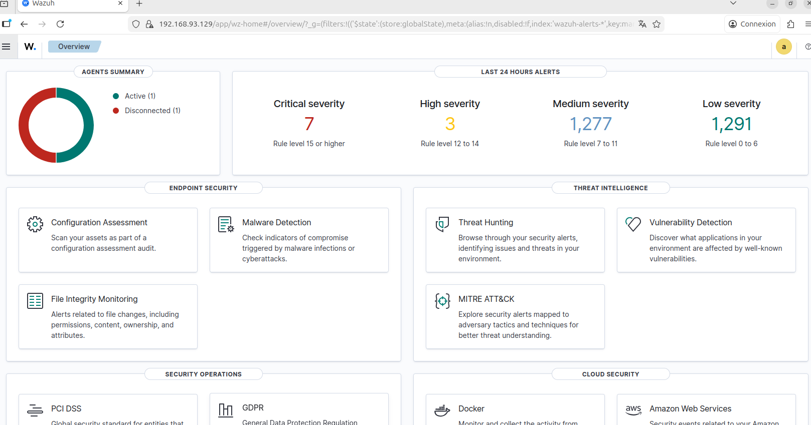

# WAZUH SIEM/XDR : DÉPLOIEMENT HYBRIDE ET INGENIERIE DE DETECTION

## Présentation
Mise en œuvre complète d'une solution **SIEM/XDR (Wazuh)** dédiée à la surveillance d'un parc hybride virtualisé (Windows/Linux). Ce projet documente la centralisation des flux de logs, l'analyse corrélative des événements et la validation des mécanismes de détection.

> **[Consulter le rapport technique complet (PDF)](./siem-lab.pdf)**

## Stack Technique
* **Solution SIEM/XDR :** Wazuh (Manager & Agents)
* **Infrastructure :** VMware Workstation
* **Systèmes supervisés :** Windows 11, Ubuntu 24.04 LTS
* **Vecteurs de test :** Hydra, Nmap, EICAR Standard Anti-Malware Test File

## Scénarios d'Attaques et Détection
Le laboratoire simule six vecteurs d'attaque afin de valider les règles de corrélation :

### Environnement Linux (Ubuntu)
1. **Brute Force SSH (Hydra) :** Simulation de 1000 tentatives d'authentification pour valider l'agrégation d'alertes.
2. **Création d'utilisateur suspect :** Monitoring des modifications administratives via les logs `auth.log`.
3. **Suppression de logs (Truncate) :** Identification des tentatives d'effacement de traces (anti-forensics).

### Environnement Windows (Windows 11)
4. **Reconnaissance réseau (Nmap) :** Détection de balayage de ports et de fingerprinting actif.
5. **Brute Force RDP :** Surveillance et analyse des échecs d'authentification sur le protocole Bureau à distance.
6. **Malware (Test EICAR) :** Validation de la remontée d'alertes de protection Endpoint via l'agent.

## Pistes d'Amélioration
* **Active Response :** Automatiser le blocage d'IP (Firewall) après détection de brute force.
* **Réduction du bruit :** Ajuster les seuils d'alertes pour limiter les faux positifs.
* **Threat Intel :** Intégrer l'API VirusTotal pour l'analyse automatique des IOC.
* **Audit SCA :** Vérifier la conformité des systèmes via les benchmarks CIS.
